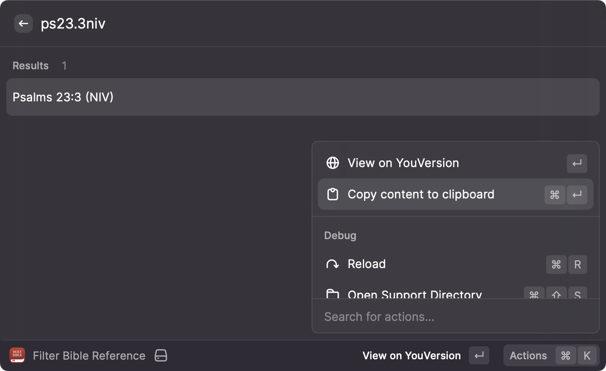
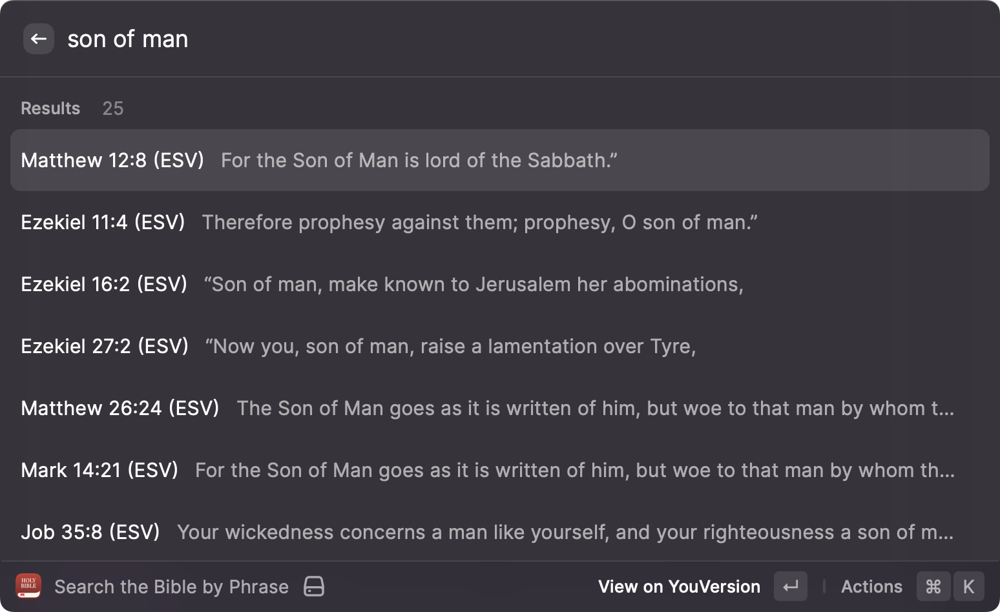

# YouVersion Suggest for Raycast

_Copyright 2022 Caleb Evans_  
_Released under the MIT license_

This [Raycast][raycast] extension allows you to search the YouVersion Bible
quickly and easily. You can:

- Look up a specific verse or chapter by name
- Search for Bible verses matching a specific phrase
- Copy any verse contents to the clipboard.
- Choose an alternate language (other than English) and/or pick your preferred
  version/translation (e.g. ESV, NKJV)

[raycast]: https://www.raycast.com/

## Commands

### Filter Bible Reference

Allows you to quickly jump to a particular Bible chapter, verse, or range of verses just by typing the name of that Bible reference

### Search the Bible by Phrase

Allows you to find Bible verses related to a particular phrase or topic

### Set Bible Preferences

Allows you to set your preferred language, version/translation, and more

## Disclaimer

This project is not affiliated with YouVersion, and all Bible content is
copyright of the respective publishers. The Bible app icon used in this
extension is property of YouVersion.
